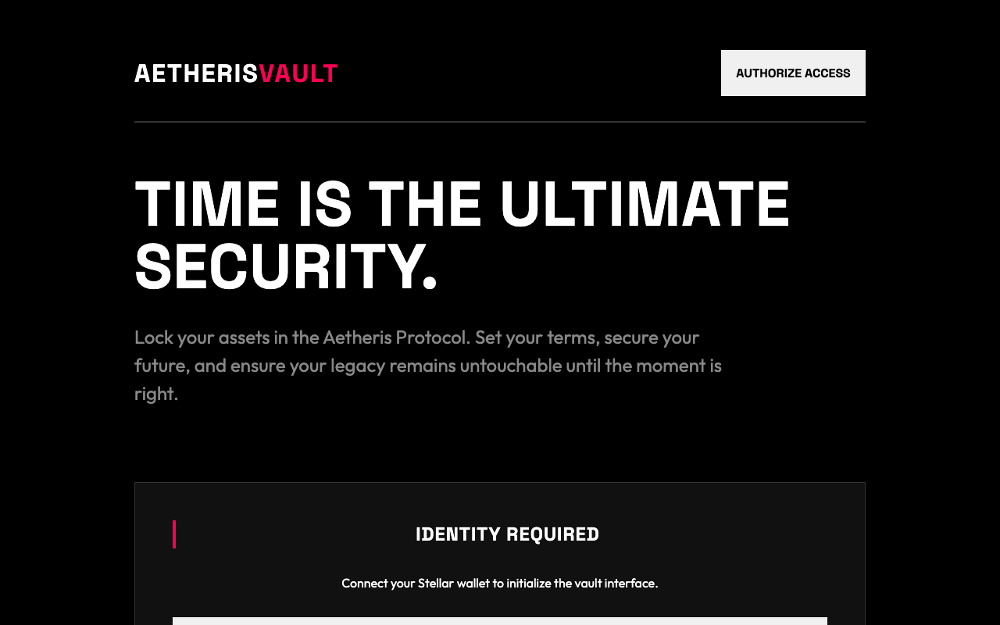

# 🔐 Aetheris Vault
### Secure Time-Locked Asset Management Protocol on Stellar



## 📖 What is this?
Aetheris Vault is a decentralized security protocol built on the Stellar network using Soroban smart contracts. it allows users to deposit assets into a digital "vault" that is cryptographically locked until a specific future date and time. Once locked, the assets cannot be withdrawn by anyone—including the owner—until the time-lock expires.

## ⚠️ The Problem
In the digital asset space, emotional decision-making (panic selling) and security vulnerabilities are major risks. Investors often struggle with "diamond-handing" their assets during market volatility, and estate planning for digital assets remains complex. Traditional solutions rely on centralized third parties which introduces counterparty risk.

## 🚀 The Vision
Aetheris aims to become the gold standard for decentralized estate planning and long-term asset security. By leveraging the immutability of the Stellar ledger, we provide a "set-and-forget" infrastructure that ensures your future self or your heirs can access assets only when the time is right, without relying on any central authority.

## ✨ Key Features
- **Immutable Time-Locks**: Assets are locked at the protocol level.
- **High-Contrast "Secure-Core" UI**: A distraction-free, high-contrast interface designed for maximum clarity and zero animations.
- **Transparent Ledger Tracking**: Every deposit and unlock is a verifiable event on the Stellar testnet.
- **Self-Sovereign Access**: Only the original depositor's signature can authorize a withdrawal once the lock expires.

---

## 🏗 Smart Contract Details
- **Network**: Stellar Testnet
- **Contract ID**: `CCECTVTJDBDGJFIWA5QHXN7VPIQLJGEA67RV76GVOI3CCQEJPCRS4HSU`
- **Language**: Rust (Soroban SDK)

### Contract Functions
- `deposit(amount, unlock_time, description)`: Lock assets until the specified timestamp.
- `withdraw()`: Release assets once the time-lock has passed.
- `get_vault(user)`: View the status of your current vault.

---

## 💻 Local Deployment Guide

### Prerequisites
- Node.js v18+
- [Stellar CLI](https://developers.stellar.org/docs/build/smart-contracts/getting-started/setup)
- [Freighter Wallet](https://www.freighter.app/)

### Installation & Run
1. **Clone & Install**:
   ```bash
   git clone https://github.com/ansonprtama/aetheris-vault.git
   cd aetheris-vault
   npm install
   ```

2. **Run Frontend**:
   ```bash
   npm run dev
   ```

3. **Build Contract (Optional)**:
   ```bash
   cd contracts/aetheris-vault
   stellar contract build
   ```

---

## 📁 Project Structure
- `contracts/aetheris-vault`: Soroban smart contract source code.
- `src/App.jsx`: Main React application logic (Zero Animations).
- `src/styles.css`: High-contrast "Aetheris" design system.
- `dist/`: Production build output.

---
*Built with 🛡️ for the future of digital finance on Stellar.*
